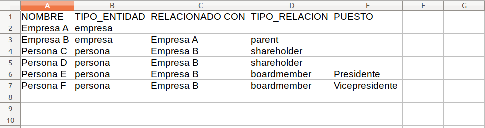

# Agregar los datos

### Datos de contratos

Para esta parte, deberás tener el listado de contratos que quieres visualizar en el formato del estándar de contrataciones abiertas [OCDS](http://standard.open-contracting.org/latest/en/). Puedes obtener el listado de alguna API, como la [API de QuienEsQuien.wiki](https://quienesquienapi.readthedocs.io) o de las fuentes OCDS utilizando la herramienta [Kingfisher](https://github.com/open-contracting/kingfisher) para guardarlo en disco. Para más información puedes revisar la [documentación completa](https://ocdskingfisher.readthedocs.io/en/latest/) de Kingfisher.  También puedes ver el listado completo de los  [Publicadores de OCDS](https://www.open-contracting.org/why-open-contracting/worldwide/#/table) que se actualiza trimestralmente.

#### Formatos de orígen
El estándar OCDS es un modelo para la publicación y análisis de datos de procesos de contratación. Los datos publicados bajo el estándar se encuentran en el formato [JSON](https://www.json.org/json-es.html) y pueden presentarse de dos formas: [release](http://standard.open-contracting.org/latest/en/schema/reference/) y [record](http://standard.open-contracting.org/latest/en/schema/records_reference/). Generalmente, los datos OCDS se publican en listados de procesos de contratación conocidos como packages. Es posible encontrar [paquetes de releases (Release Packages)](http://standard.open-contracting.org/latest/en/schema/release_package/) y [paquetes de records (Record Packages)](http://standard.open-contracting.org/latest/en/schema/record_package/) publicados por los gobiernos de ciertos países.

Dependiendo del oríen de los datos, deberás modificar el archivo `_config.yml` para especificar el formato. Esto se hace en la opción `contracts_format` dentro de `graph`. Las diferentes opciones son:
* `releases_json`, este tiene la estructura `{releases: [] }`. Sirve para cuando tienes los contratos en un archivo.
* `records_json_api`, este tiene la estructura: `{data: { records: [ {compiledRelease: {} }] } }` y sirve cuando lso datos vienen de la API de QuienEsQuien.wiki.
* `csv` esta opción aún no está implementada, pero sirve para cuando tienes los contratos en una planilla de cálculo y los exportas a una archivo CSV.

#### Datos en archivo json

Los datos deberán ser colocados en un archivo con el nombre **contracts.json** y el archivo ubicado en la ruta *assets/data/*. Para subir el archivo al repositorio de Github, debes ubicarte en la página principal del repositorio en tu navegador. En el listado de archivos, primero haz click en la carpeta *assets* y en la pantalla siguiente haz click en la carpeta *data*. Una vez estés adentro de la carpeta *data* debes hacer click en el botón "Upload files", ubicado sobre la tabla del listado de archivos al lado derecho de la pantalla. Esto te llevará a una pantalla desde la cual puedes elegir el archivo desde tu computadora o arrastrarlo hacia la ventana del navegador. Si no ves el botón para subir archivos debes iniciar sesión en Github con tu usuario y contraseña.

El archivo de datos deberá contener un listado de records o releases de los procesos de contratación. Para lograr que el archivo sea sólo el listado de records o releases dentro de un array, puede ser necesario manipular el contenido del archivo. Para esto recomendamos la herramienta [ocdskit](https://github.com/open-contracting/ocdskit) y en particular [jq](https://stedolan.github.io/jq/).

**Estructura del archivo contracts.json**

El archivo contracts.json debe cumplir con la estructura de uno de los siguientes tipos de datos: [Release Package](http://standard.open-contracting.org/latest/en/schema/release_package/) o [Record Package](http://standard.open-contracting.org/latest/en/schema/record_package/).

Un **Release Package** es un objeto JSON con una propiedad llamada «releases», la cual contiene un listado en forma de array, es decir, entre corchetes [], cuyos elementos son objetos individuales de tipo [release](http://standard.open-contracting.org/latest/en/schema/reference/) separados por comas (,). Cada objeto de tipo release corresponde a un proceso individual de contratación.
```
{
	"releases": [
        { (release 1) },
        { (release 2) },
        ...
        { (release n) }
    ]
}
```

Un **Record Package** es un objeto JSON con una propiedad llamada «records», la cual contiene un listado en forma de array, es decir, entre corchetes [], cuyos elementos son objetos individuales de tipo [record](http://standard.open-contracting.org/latest/en/schema/records_reference/) separados por comas (,). Cada objeto de tipo record se compone a su vez de dos propiedades: una propiedad llamada «releases», la cual debe cumplir con el mismo formato que los Release Packages descritos anteriormente, y otra propiedad llamada «compiledRelease», la cual contiene un objeto individual de tipo [release](http://standard.open-contracting.org/latest/en/schema/reference/). Cada objeto de tipo record corresponde a un proceso individual de contratación. El listado de releases dentro del objeto de tipo record contiene el historial de versiones publicadas para un proceso de contratación, y el objeto compiledRelease contiene la última versión de cada dato individual del mismo proceso de contratación.
```
{
	"records": [
        {
            "releases": [
                { (release 1) },
                { (release 2) },
                ...
                { (release n) }
            ],
            "compiledRelease": { (última versión del release) }
        },
        { (record 2) },
        ...
        { (record n) }
    ]
}
```

Nota: dentro de cada release, es necesario que ciertos campos contengan algún valor para que los gráficos se desplieguen de manera correcta. Los campos obligatorios son:
- *ocid*
- *tender.title*
- *tender.mainProcurementCategory*
- *tender.procurementMethodDetails*
- *contracts.value.amount*
- *contracts.value.currency*
- Dentro del campo parties, al menos uno con *role: ["supplier"]* y con valores para los campos de *id* y *name*

**Guía: armar un listado de contratos manualmente**

1. Navega hacia un repositorio o API de datos abiertos que ofrezca descargas de contratos en el formato OCDS. Para esta guía utilizaremos los datos encontrados en la API de [https://api.datos.gob.mx/](https://api.datos.gob.mx/).
2. Para este ejemplo utilizaremos esta consulta para obtener un listado de contratos en formato JSON: [https://api.datos.gob.mx/v2/Releases_SFP](https://api.datos.gob.mx/v2/Releases_SFP). Realiza la consulta ingresando el URL anterior en tu navegador.
3. Guarda el resultado desde el navegador en tu disco duro, verificando que su extensión sea .json.
    - Firefox: desde el menú principal (puedes hacerlo visible en Firefox presionando la tecla Alt) selecciona: *Archivo > Guardar como* (*File > Save as*, en inglés) o presiona *Ctrl + S*.
    - Chrome: utiliza el botón de la esquina superior derecha para mostrar el menú principal, luego selecciona: *Más herramientas > Guardar página como* (*More tools > Save page as*, en inglés) o presiona *Ctrl + S*.
4. Abre una terminal de línea de comando y navega hasta la ubicación del archivo que has descargado. Si nunca has usado la línea de comando, puedes leer los siguientes tutoriales para aprender: [Linux](https://openwebinars.net/blog/La-guia-definitiva-para-aprender-a-usar-la-terminal-de-Linux/) / [Windows](https://www.abrirllave.com/cmd/guion-del-tutorial.php) / [Mac](http://foro-mac.com.ar/tutorial-como-usar-la-terminal-en-mac/).
5. Utiliza **jq** para trabajar con los datos JSON y darles la forma necesaria. Encontrarás instrucciones de descarga e instalación para tu sistema operativo [aquí](https://stedolan.github.io/jq/download/). Puedes aprender a utilizar jq leyendo el [manual oficial](https://stedolan.github.io/jq/manual/).
6. La respuesta de la API consiste de un objeto raíz que contiene, entre otras, la propiedad "results". El valor de "results" es el listado de contratos en OCDS que necesitas para TowerBuilder. Con el siguiente comando (en Linux) puedes extraer el listado, colocarlo dentro de un objeto llamado "releases", y guardarlo en un archivo llamado *contracts.json*:
    ```
    cat Releases_SFP.json | jq '{releases: .results}' > contracts.json
    ```
    - *cat Releases_SFP.json*: leer el contenido del archivo Releases_SFP.json y mostrarlo en pantalla.
    - *| jq*: tomar el resultado del comando anterior y enviarlo al comando jq como input.
    - *{releases: .results}*: filtrar el JSON recibido como input, tomando el valor de la propiedad "results" y guardándolo en una nueva propiedad llamada "releases".
    - *> contracts.json*: tomar el resultado del filtro anterior, y guardarlo como un archivo llamado "contracts.json" en la carpeta actual.
7. Copia el archivo *contracts.json* a la carpeta *assets/data/* de tu repositorio, como se explica en la sección anterior.

#### Datos provenientes de API

Primero debes obtener la URL de consulta a la API que devuelva el conjunto de contratos que quieres. Para esto deberás ayudarte de la documentación de la misma. En el caso de la Api de QuienEsQuien.wiki, puedes leer la [documentación aquí](https://quienesquienapi.readthedocs.io).

Una vez que tengas la url, debes modificar en `_config.yml` la opción `contracts_url` con esta dirección y no te olvides de modificar `graph.contract_format` con el valor `records_json_api` como se indica en el apartado "Formatos de orígen".

#### Datos en archivo csv

Los datos deberán ser colocados en un archivo con el nombre **contracts.csv** y el archivo ubicado en la ruta *assets/data/*. Para subir el archivo al repositorio de Github, debes ubicarte en la página principal del repositorio en tu navegador. En el listado de archivos, primero haz click en la carpeta *assets* y en la pantalla siguiente haz click en la carpeta *data*. Una vez estés adentro de la carpeta *data* debes hacer click en el botón "Upload files", ubicado sobre la tabla del listado de archivos al lado derecho de la pantalla. Esto te llevará a una pantalla desde la cual puedes elegir el archivo desde tu computadora o arrastrarlo hacia la ventana del navegador. Si no ves el botón para subir archivos debes iniciar sesión en Github con tu usuario y contraseña.

El archivo de datos deberá contener un listado de contratos, uno por fila. Al momento de exportar el csv, asegúrate de que el separador sea una coma (,) y los datos estén encapsulados con comillas dobles (""). El archivo debe contener las siguientes columnas, con una primera fila de encabezados que contiene el título de la columna en mayúsculas tal y como aparece en el listado, y los valores para cada columna deberán ser el campo OCDS que aparece entre paréntesis en la descripción:

- OCID: identificador del proceso de contratación (ocid)
- CONTRACT_TITLE: el título del contrato (contracts.title)
- CONTRACT_TYPE: la categoría o tipo del contrato (tender.mainProcurementCategory)
- PROCUREMENT_METHOD: el procedimiento de contratación (tender.procurementMethod)
- BUYER_NAME: nombre de la unidad compradora (buyer.name)
- SUPPLIER_NAMES: nombres de los proveedores, separados por punto y coma (;) (awards.suppliers.name)
- CONTRACT_START_DATE: fecha de inicio del contrato (contracts.period.startDate)
- CONTRACT_END_DATE: fecha de fin del contrato (contracts.period.endDate)
- CONTRACT_AMOUNT: monto del contrato (contracts.value.amount)
- CONTRACT_CURRENCY: moneda del contrato (contracts.value.currency)

Luego de colocar el archivo en la ruta apropiada debes editar el archivo *_config.yml* de la siguiente manera:

- Buscar la llave *contracts_url* y colocarle el valor **"/assets/data/contracts.csv"**
- Buscar la llave *contracts_format* y colocarle el valor **"csv"**

#### Datos en hoja de cálculo en línea

Si deseas utilizar una hoja de cálculo de Google Docs, luego de completar la base de datos como lo describe la sección anterior debes publicar el documento utilizando el menú **File > Publish to the web**. En el popup seleccionar la hoja en la que están los datos de los contratos, y luego en el siguiente selector debes elegir la opción "Comma-separated values (.csv)". Copia el enlace generado y verifica en tu navegador que se descarguen los datos en el formato CSV. Luego busca el archivo *_config.yml* y edítalo de la siguiente manera:

- Buscar la llave *contracts_url* y colocarle el enlace generado al publicar el documento, entre comillas
- Buscar la llave *contracts_format* y colocarle el valor **"csv"**

### Datos de beneficiarios reales

Para complementar los datos de procesos de contratación es posible indicar la manera como éstos se relacionan con las personas y empresas que se encuentran detrás de las entidades que aparecen en los datos publicados bajo OCDS. Las relaciones se expresan como un árbol de jerarquías, en el cual se establecen relaciones entre empresas (una empresa matriz y sus subsidiarias) o entre empresas y personas (accionistas y miembros de juntas directivas de una empresa). Este árbol de jerarquías permite establecer quiénes son los beneficiarios reales de los procesos de contratación analizados.

> Un Beneficiario Real es la persona física o natural quien, directa o indirectamente y en última instancia, posee, influencia, controla y/o se beneficia de al menos el 5% de un activo mediante un vehículo corporativo, sociedad mercantil o fideicomiso. Más información sobre Beneficiarios Reales, [aquí](https://www.colaboratorio.org/beneficiarios-reales-en-mexico/).

Para crear el conjunto de datos de beneficiarios reales debes usar la plantilla disponible en *assets/data/BO-template.csv*, editarla en un software de planilla de cálculo (LibreOffice Calc, MS Excel, Google Spreadsheets u otro) y modificar los valores. El archivo contiene las siguientes columnas:

1. **NOMBRE:** el nombre de la entidad (persona o empresa) tal y como aparece en los datos OCDS.
2. **TIPO_ENTIDAD:** las palabras "*empresa*" o "*persona*" según la entidad de la primera columna.
3. **RELACIONADO_CON:** la entidad con la cual se desea establecer la relación.
4. **TIPO_RELACION:** cómo se relaciona la entidad de la primera columna con la entidad de la tercera columna. Puede contener los siguientes valores:
    - "*parent*" para establecer que la empresa en la tercera columna es subsidiaria de la empresa en la primera columna.
    - "*shareholder*" cuando la persona de la primera columna es accionista de la empresa en la tercera columna.
    - "*boardmember*" si la persona en la primera columna está en la junta directiva de la empresa en la tercera columna.
5. **PUESTO:** el nombre del puesto que ocupa la persona. Sólo aplica para un TIPO_RELACION con un valor de "*boardmember*".

Cada fila del archivo representa una rama del árbol de jerarquías, partiendo de una fila raíz que contendrá solamente el nombre de la empresa en la primera columna y la palabra "empresa" en la segunda. Es importante que en cada fila pongas los nombres de las empresas tal cual están en el listado de contratos, para que se pueda vincular la información en el gráfico. Como ejemplo, puedes tomar la siguiente jerarquía:

- **Empresa A** (1) aparece en un proceso de contratación.
- **Empresa B** (2) es la empresa matriz de **Empresa A**.
- **Persona C** (3) y **Persona D** (4) son accionistas de **Empresa B**.
- **Persona E** (5) y **Persona F** (6) son el **Presidente** y el **Vicepresidente** de la junta directiva de **Empresa B**.

Deberás llenar el archivo de la siguiente manera, con la información de cada entidad en una fila separada:



Repite el mismo proceso para cada jerarquía de empresas de la que tengas datos. Una vez tu archivo esté completo, puedes utilizar el mismo procedimiento de la sección anterior para subirlo a la carpeta *assets/data/*. Para este archivo deberás utilizar el nombre **owners.csv**.
